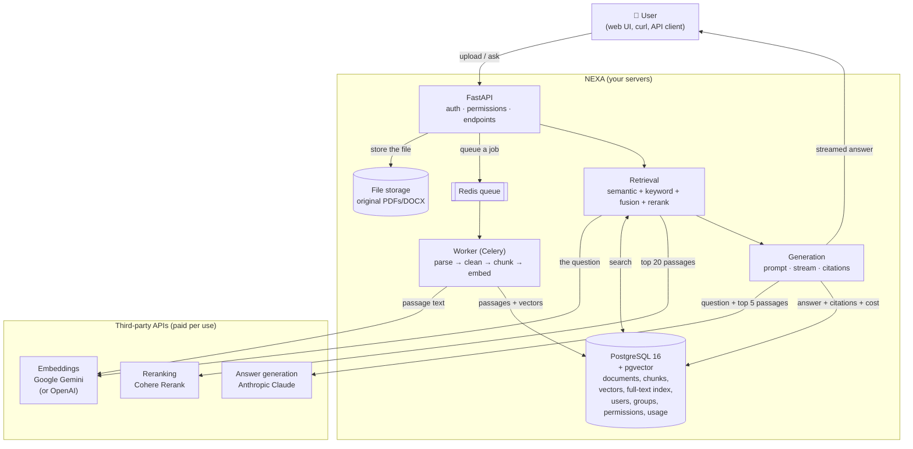
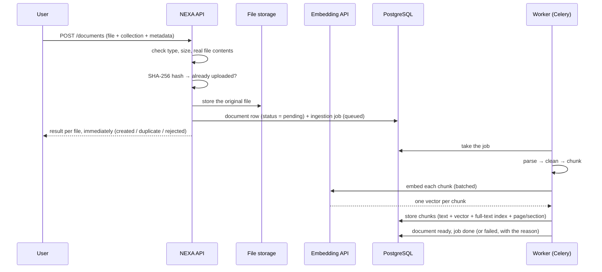
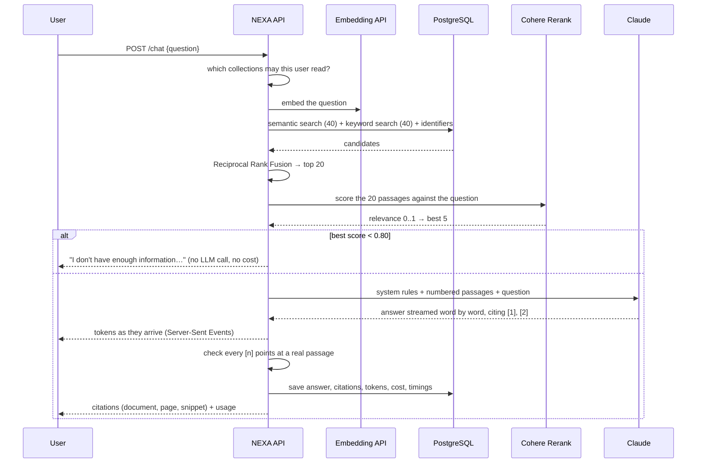
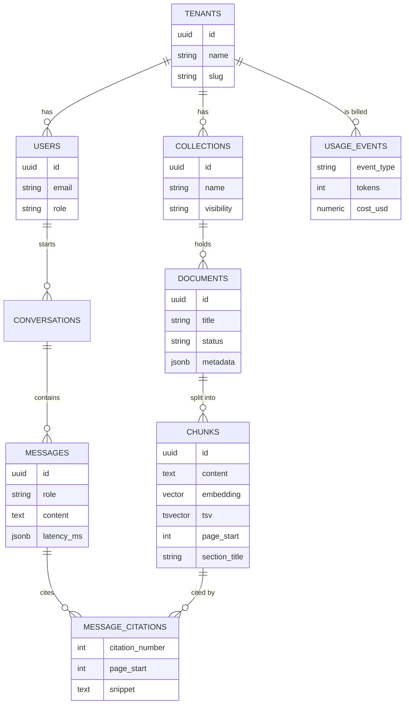

# How NEXA works

A plain-language tour of the whole system: what happens to a document, what
happens to a question, which outside services are involved, what they cost, and
what every piece of jargon means.

- Want the **code** path, file by file? See [architecture.md](architecture.md).
- Want the **measured numbers**? See [evaluation-results.md](evaluation-results.md).

---

## 1. The idea in one paragraph

A business has thousands of documents. People can't find things in them. NEXA
reads those documents once, cuts them into passages, and stores a "meaning
fingerprint" of each passage. When someone asks a question, NEXA finds the few
passages most likely to contain the answer and asks a large language model
(Claude) to answer **using only those passages**, quoting where each fact came
from. If nothing relevant is found, it says so instead of inventing an answer.
Every company's documents stay separate, and people only ever see the documents
they're allowed to see.

That pattern — retrieve first, then generate — is called **RAG**:
Retrieval-Augmented Generation.

---

## 2. The big picture

**Everything that holds your data — the API, the database, the files — runs on
your own machine or server.** The three boxes on the right are the only places
where text leaves your server, and only in small pieces: passage text when
indexing, and the question plus five passages when answering.

---

## 3. The outside services, and why each one exists

| Service | What it does for us | Model we use | Price | Free option | Configured by |
|---|---|---|---|---|---|
| **Google Gemini** (or **OpenAI**) | Turns text into a vector of 1,536 numbers that captures meaning ("embedding"). Used for every passage at upload time and for every question | `gemini-embedding-001` (or `text-embedding-3-small`) | Gemini: $0.15 / 1M tokens · OpenAI: $0.02 / 1M tokens | **Yes** (Gemini free tier, ~100 embeddings/minute) | `EMBEDDING_PROVIDER`, `GEMINI_API_KEY` / `OPENAI_API_KEY` |
| **Cohere Rerank** | Reads the question and each candidate passage *together* and scores how well it answers the question. Reorders the top 20 into the best 5, and its score decides "I don't know" | `rerank-v4.0-pro` | $0.0025 per question | **Trial key:** 1,000 calls/month, 10/minute | `RERANKER_PROVIDER`, `COHERE_API_KEY` |
| **Anthropic Claude** | Writes the answer from the passages, with `[1]`-style citations | `claude-opus-5` | $5 / 1M input tokens, $25 / 1M output | No free tier (small trial credit) | `LLM_PROVIDER`, `ANTHROPIC_API_KEY` |
| **PostgreSQL + pgvector** | Stores everything and does BOTH searches: vector similarity and full-text keyword search | Postgres 16, pgvector 0.8 | Free, self-hosted | — | `DATABASE_URL` |
| **Redis** | Queue between the API and the ingestion worker | Redis 7 | Free, self-hosted | — | `REDIS_URL` |

**Cost of one question today:** about $0.014–0.022 for Claude, $0.0025 for
Cohere (free on the trial key) and a fraction of a cent for embedding the
question. Indexing all 16 sample documents costs well under one cent.

**Swapping providers is a config change**, not a code change: every provider
sits behind a small interface (`services/embeddings/`, `services/retrieval/reranker.py`,
`services/generation/llm.py`). `fake` versions of all three run fully offline,
which is how the test suite runs without API keys or costs.

**Privacy.** Tell clients exactly which services see their text. Gemini's *free*
tier may use the data to improve Google's products, so it's for demos only;
paid tiers of all three providers don't train on your data. For clients who
can't send documents anywhere, the same interfaces accept a local embedding
model and a local reranker — that's a selling point, and a later task.

---

## 4. What happens when you upload a document

Step by step:

1. **Validate.** Allowed types (PDF, DOCX, Markdown, TXT, HTML, CSV), size
   limit, and a check that the bytes really are that type.
2. **Deduplicate.** A SHA-256 hash of the file means the same document is never
   indexed twice for a tenant. If a previous attempt failed, re-uploading
   retries it.
3. **Parse.** PDFs keep page numbers, and headings are detected by font size;
   Word documents use their real heading styles and tables; Markdown uses `#`.
4. **Clean.** Fix invisible character noise and drop repeated page headers and
   footers (they'd otherwise pollute every passage).
5. **Chunk.** Cut into passages of about 600 tokens, at section boundaries,
   never mid-sentence, with an 80-token overlap so a fact spanning the boundary
   is whole in at least one chunk. Each chunk remembers its page range and
   section, which is what makes citations exact.
6. **Add a contextual header.** "Document: Residential Tenancy Agreement - Unit
   4B | Section: 7. Term and Termination" is prefixed to what gets embedded and
   indexed, so a passage knows which document it belongs to. Measured: this
   alone raised first-place accuracy from 70% to 85%.
7. **Embed** every chunk in batches, and **store** text, vector, full-text
   index, page range, section and metadata.

Steps 3–7 run in the **background worker**, so uploading 100 files returns at
once. Each document's `status` (pending → processing → ready/failed) and its
job record (attempts, error, chunks created) say exactly where it is.
`POST /documents/{id}/reindex` runs it again after a failure or a settings
change; `INGESTION_MODE=inline` does the work in the request instead, which is
what the tests use.

---

## 5. What happens when you ask a question

Why so many steps? Each one fixes a specific failure:

| Step | The problem it solves |
|---|---|
| Permission scoping first | A user must never even *rank* a document they can't read |
| Semantic search | Finds paraphrases: "how long do I have to warn the landlord" ↔ "60 days written notice" |
| Keyword search | Finds exact terms embeddings blur: `E-204`, `Clause 7.2` |
| Identifier boost | Postgres doesn't know rare words matter more, so the code gives identifiers their own search |
| Fusion (RRF) | Merges two rankings that use different score scales, by rank instead of score |
| Reranker | Reads question + passage together and picks the genuinely best ones |
| Relevance gate | Cheap, honest "I don't know" for off-topic questions |
| Numbered passages + citation rules | The model can only cite what it was given, and we verify every `[n]` |
| Saving usage | Real per-question cost, latency and sources for every answer |

---

## 6. The data model

- **Tenant** = one client company. Every row that belongs to a company carries
  its `tenant_id`, and the tenant always comes from the logged-in user.
- **Collection** = a folder of documents that share access rules
  ("Public FAQ", "Compliance"). Access to a restricted collection is granted to
  a **group** (read or write), and users belong to groups.
- **Row-Level Security** means PostgreSQL itself enforces the tenant boundary:
  each request runs as an unprivileged role with `app.tenant_id` set, so even a
  query that forgets `WHERE tenant_id = …` returns nothing from another tenant.
- **Chunk** = one passage, with its vector, its full-text index, and where it
  came from.

---

## 7. Jargon, translated

| Term | What it actually means |
|---|---|
| **RAG** | Retrieval-Augmented Generation: find relevant text first, then let the model answer from it |
| **Token** | About ¾ of a word. APIs bill per token |
| **Embedding / vector** | A list of 1,536 numbers representing meaning. Similar meaning → similar numbers |
| **Cosine similarity** | How closely two vectors point the same way: 1.0 = identical direction, 0 = unrelated |
| **Chunk** | One passage of a document, sized to be about one topic |
| **Chunk overlap** | Repeating the last sentences of a chunk at the start of the next one, so facts on the boundary survive |
| **HNSW index** | The data structure that makes "find the nearest vectors" fast without comparing everything |
| **tsvector / full-text search** | Postgres's word index: "terminating" and "termination" both become "termin" |
| **IDF** | "Rare words matter more". BM25 engines do this; plain Postgres ranking doesn't, which is why we boost identifiers |
| **RRF** | Reciprocal Rank Fusion: merge rankings by position (1/(60+rank)) rather than by incomparable scores |
| **Bi-encoder** | Question and passage are embedded separately, then compared. Fast, coarse. That's the search step |
| **Cross-encoder / reranker** | Reads question and passage together and scores them. Slow, precise. That's the rerank step |
| **Hallucination** | The model stating something the documents don't support. Citations + the "answer only from the passages" rule + the relevance gate are the defences |
| **Prompt injection** | A document containing "ignore your instructions". We label passages as data and tell the model to ignore instructions inside them |
| **Multi-tenancy** | One system serving several companies whose data must never mix |
| **RLS** | Postgres Row-Level Security: the database itself refuses to return another tenant's rows, even if the code forgets a filter (Week 4) |
| **SSE** | Server-Sent Events: the simple HTTP streaming that makes answers appear word by word |

---

## 8. What exists today, and what's next

| Week | Added | Status |
|---|---|---|
| 0–1 | Docker setup, database, auth, upload, parse/clean/chunk, embeddings | ✅ |
| 2 | Semantic search, streaming chat, verified citations, usage and cost tracking | ✅ |
| 3 | Keyword + hybrid search, identifier boost, Cohere reranking, contextual headers, metadata filters, the evaluation harness | ✅ |
| 4 | Groups and per-collection permissions, Row-Level Security, background ingestion (Celery), HTML/CSV, delete and re-index endpoints | ✅ |
| 5 | Web interface (Next.js): upload, chat with citations, admin dashboard | ✅ |
| 6 | Follow-up question rewriting, agent tools (summarise, compare, extract), answer-quality eval | planned |
| 7 | Rate limits, caching, prompt-injection tests, CI, benchmarks at 1k and 10k documents | planned |
| 8 | Deployment, demo tenants, launch | planned |
